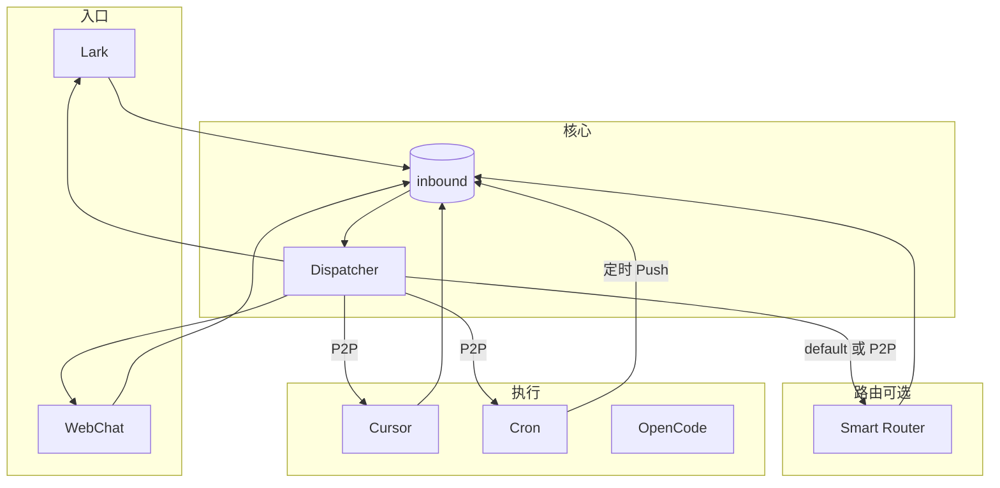

# MyBot 设计文档（合并版）

## 1. 架构概览

**原则**：万物皆适配器，全对称消息总线。入口（Lark/WebChat）、执行（Cursor/OpenCode）、定时（Cron）均通过统一 Message 经 Dispatcher 路由。



- **消息流**：入口 Push 到 `inbound`，Dispatcher 按 `TargetAdapter` 或 `system.default_adapter` 投递；执行端处理完后 Push，`TargetAdapter = msg.SourceAdapter` 回源。
- **推荐栈**：Lark/Web + Smart Router（可选）+ Cursor + Cron；`default_adapter` 直连 Cursor 或设为 Smart Router 按规则分流。

### 1.1 核心概念

| 概念 | 说明 |
|------|------|
| **Message** | ID、SourceAdapter、TargetAdapter、UserID、Channel、Content、Type、Files、Extra |
| **P2P** | 指定 TargetAdapter 直接投递 |
| **默认路由** | 未指定 Target 时投递到 `system.default_adapter` |
| **回源** | 回复时 `TargetAdapter = msg.SourceAdapter`，避免指回 Router 形成环 |

### 1.2 防循环

- **max_hops**（默认 20）：Dispatcher 累计 `_hop`，超则丢消息。
- **Smart Router**：禁止 rule 的 `target` 指向自身。
- **回复语义**：执行端一律用 `msg.SourceAdapter` 作为回复目标，慎用 `default_target` 指回 Router。

---

## 2. 配置与使用

### 2.1 两种模式

**模式 A：直连 Cursor（最简单）**

- `default_adapter: "cursor.cursor_1"`
- 流：Lark/Web → Dispatcher → Cursor → 回复回源。

**模式 B：带 Smart Router（按前缀分流）**

- `default_adapter: "smart_router_1"`，Smart Router 的 `default_target: "cursor.cursor_1"`
- 规则示例：`/code` → opencode，其余 → Cursor。

### 2.2 最小配置示例（直连）

```yaml
system:
  work_dir: "."
  default_adapter: "cursor.cursor_1"
  max_hops: 20

adapters:
  - id: "lark_bot"
    type: "lark"
    enabled: true
    app_id: "YOUR_APP_ID"
    app_secret: "YOUR_APP_SECRET"
  - id: "webchat"
    type: "webchat"
    enabled: true
    port: 8080
  - id: "cursor_1"
    type: "cursor"
    enabled: true
  - id: "cron_1"
    type: "cron"
    enabled: true
    api_addr: "127.0.0.1:9090"
```

---

## 3. Cron 定时任务

### 3.1 概念

- **Cron 以 Adapter 形式存在**，与其它 adapter 平等；创建任务：发 Message（TargetAdapter = cron）或调 HTTP API；触发时向 inbound 投递合成 Message，由 Dispatcher 按 `payload.target_adapter` 路由，执行端按 `msg.SourceAdapter` 回源。
- **reply_to**：记录任务源头（source_adapter、user_id、channel），触发时作为 Message 的源字段。
- **payload**：触发时投递内容（target_adapter、content、type、files、extra）。

### 3.2 创建任务

**方式一：Message**  
发一条 `TargetAdapter = cron_1` 的 Message，Extra 示例：

```yaml
cron_action: "create"
schedule: "0 9 * * *"
payload:
  target_adapter: "cursor_1"
  content: "每日任务"
  type: "text"
```

**方式二：HTTP API**（Cron 配置 `api_addr` 时）

| 方法 | 路径 | 说明 |
|------|------|------|
| POST | `/cron/jobs` | 创建任务 |
| GET  | `/cron/jobs` | 列出任务 |
| GET  | `/cron/jobs/:id` | 查询单个 |
| DELETE | `/cron/jobs/:id` | 取消任务 |

### 3.3 配置

```yaml
adapters:
  - id: "cron_1"
    type: "cron"
    enabled: true
    api_addr: "127.0.0.1:9090"
```

### 3.4 与 OpenClaw 对比（简要）

| 维度 | OpenClaw | MyBot |
|------|----------|--------|
| 归属 | Gateway 内置 context.cron | 独立 Cron Adapter |
| 创建 | WebSocket RPC | Message + HTTP API |
| 存储 | JSON 文件 | SQLite |
| 回源 | main/isolated + delivery | Message(reply_to+payload) → Dispatcher → 任意 source_adapter |

---

## 4. StateStore

- **用途**：自动记录消息转发历史，支持查询、统计与 Web 管理界面。
- **配置**（config.yaml）：

```yaml
system:
  state_store:
    enabled: true
    db_path: "./data/state.db"
    auto_cleanup: true
    cleanup_days: 30
```

- **接口**：`GET /admin` 管理页；`GET /api/messages` 查询消息（支持 source_adapter、target_adapter、user_id、channel、type、时间范围、limit/offset）；`GET /api/stats` 统计。

---

## 5. OpenCode 个人助理对接要点

- **目标**：Lark/Slack/Discord 等入口 + OpenCode API，无感 Session、`/reset` 清理、AGENTS.md 初始化。
- **Session 策略**：平台 (user/channel/thread) → 映射 (directory?, sessionID)；首次发言创建 Session，后续复用；`/reset` 时清理并建新 Session。
- **必接 API**：`/global/health`；`/session` GET/POST、`/session/status`、`/session/{id}`；`/session/{id}/message`（发消息/历史）、`/session/{id}/init`（AGENTS.md）；`/event`（SSE）；`/permission`、`/question` 的 reply/reject。
- **建议**：交互记录与 sessionID 映射落盘，便于用户查看与审计。

---

## 6. 小结

| 主题 | 要点 |
|------|------|
| 架构 | 全对称 Adapter + Dispatcher + inbound；回源防环；max_hops + Smart Router 禁止自指 |
| 配置 | 直连 Cursor 或 Smart Router 分流；推荐最小 adapter 集：Lark/Web + Cursor + Cron |
| Cron | Adapter 形态；Message/HTTP 创建；reply_to 回源；SQLite 存储 |
| StateStore | 可选；消息历史与统计；config + /admin、/api/messages、/api/stats |
| OpenCode Bot | Session 映射 + 无感复用 + /reset；必接 session/event/permission/question；init 与落盘 |
