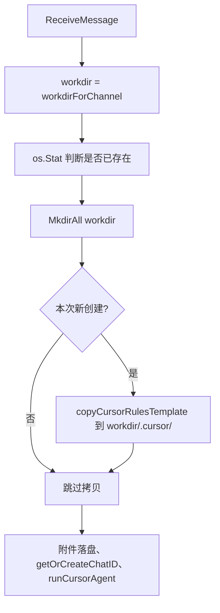

# Cursor 规则自动初始化方案

## 1. 背景与目标

**问题**：新会话 workdir 为空目录，若希望 Cursor Agent 遵循统一规则（代码风格、技术栈、记忆约定等），需每次手动创建或粘贴规则，体验差、难统一。

**目标**：新会话创建时自动将默认规则放入 workdir，规则在代码库中集中维护一份，与现有「按 channel/user 建 workdir」架构一致。

---

## 2. 实现概述

采用 **「代码库内模板 + 编译时嵌入 + 首次创建 workdir 时拷贝」**：

| 项 | 说明 |
|----|------|
| 模板位置 | `adapters/cursor/rules_template/`（与 Cursor 适配器同仓） |
| 模板来源 | `//go:embed rules_template` 编译进二进制，无需运行时路径配置 |
| 拷贝目标 | `workdir/.cursor/`（模板**内容**落入 `.cursor/`，如 `workdir/.cursor/AGENTS.md`、`workdir/.cursor/memory/`） |
| 触发时机 | Cursor 适配器在 `ReceiveMessage` 中，**首次**为某 channel/user 创建 workdir 时（`os.Stat(workdir)` 此前为不存在） |
| 覆盖策略 | **不覆盖**：目标路径已存在则跳过，避免覆盖用户已改规则 |

---

## 3. 模板结构（当前实现）

```text
adapters/cursor/rules_template/
├── README.md       # 模板说明、.cursor 与 MCP/Skills 扩展说明
├── AGENTS.md       # 能力、文件与内容、写入规则、压缩前刷写
├── USER.md         # 用户信息
├── TODO.md         # 待办
├── TOOLS.md        # 工具约定、MCP、Skills、常用命令
├── MEMORY.md       # 长期记忆
└── memory/
    └── README.md   # 按日 YYYY-MM-DD.md 约定
```

设计参考 OpenClaw 记忆范式；可选扩展由用户自建：`.cursor/mcp.json`、`.cursor/rules/*.mdc`。

---

## 4. 流程（与代码对应）



---

## 5. 与现有组件关系

- **Cursor 适配器**：在 `ReceiveMessage` 中，`MkdirAll` 后、若 `!workdirExisted` 则调用 `copyCursorRulesTemplate(workdir)`；模板路径由 embed 固定，无配置项。
- **其他适配器**：若 OpenCode 等也需要「新 session 目录带规则」，可复用「模板目录 + 拷贝逻辑」为公共函数，在各自首次创建 workdir 时调用。
- **Dispatcher / 消息模型**：无改动。

---

## 6. 小结

| 项 | 说明 |
|----|------|
| 思路 | 模板 `rules_template/` 通过 embed 内置，新 workdir 创建时拷贝到 **workdir/.cursor/** |
| 触发 | 首次为 channel/user 创建 workdir 时执行一次拷贝 |
| 覆盖 | 不覆盖已有文件 |
| 配置 | 当前无（模板路径写死为 embed）；若需可部署替换，可后续加 `rules_template_path` 等配置 |
