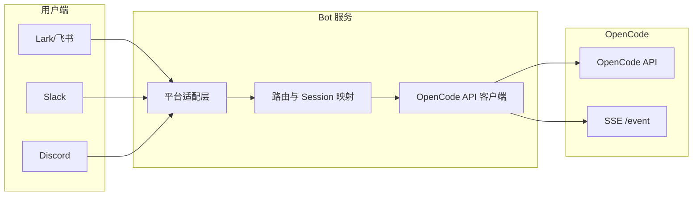

# 基于 OpenCode API 的个人助理 Bot 需求分析

## 1. 项目概述

### 1.1 目标

实现一个**个人助理 Bot**，后端通过 **OpenCode API** 与 AI 对话与代码能力交互，前端对接常见协作与聊天平台（Lark/飞书、Slack、Discord 等），使用户在习惯的 IM 环境中获得“个人助理”体验。

### 1.2 核心价值

- **统一入口**：在 Lark/Slack/Discord 中与同一套 OpenCode 能力交互，无需切换工具。
- **会话与上下文**：依赖 OpenCode 的 Session 模型管理多轮对话与上下文。
- **可扩展**：Bot 层只做协议适配与路由，业务与模型能力由 OpenCode 提供。

### 1.4 产品原则（新增）

- **尽量无感**：用户无需主动“选 Session、建会话”，默认一个对话上下文对应一个 Session，持续复用；仅在需要清空上下文时通过 **`/reset`** 显式清理并重新开始。
- **可审计、可查看**：OpenCode 的交互记录与 sessionID 持久化到**文件**，用户可在本地查看历史会话与对应 sessionID，便于回溯与排查。
- **Agent 能力可定制**：不同用户对 Agent 的能力与约束要求不同，通过 **AGENTS.md 初始化**（`session.init`）为会话/项目生成或更新 Agent 配置，使每个用户或工作区获得符合预期的能力集。

### 1.3 文档范围

本文档仅做**需求与接口分析**，不涉及具体实现代码。基于 `opencode/openapi.json` 分析需要调用的接口、Session 管理方式、以及 Session 切换策略。

---

## 2. 需要调用的 OpenCode API 清单

以下按**能力域**归纳 Bot 必须或建议使用的接口。

### 2.1 健康与连接

| 接口 | 方法 | 用途 |
|------|------|------|
| `/global/health` | GET | 启动时或定时检查 OpenCode 服务是否可用、版本信息。 |

### 2.2 项目与工作目录（directory）

多数 Session/消息接口都支持可选查询参数 `directory`，用于限定项目/工作目录。Bot 需要先明确“当前上下文对应哪个目录”。

| 接口 | 方法 | 用途 |
|------|------|------|
| `/project` | GET | 列出已打开的项目（可选 `directory` 过滤）。用于展示用户可选的“工作区”。 |
| `/project/current` | GET | 获取当前活动项目（可选 `directory`）。用于解析“当前项目”对应的 directory。 |

**结论**：Bot 侧需要维护「平台用户/频道/线程 → directory」的映射；调用 Session/消息相关接口时统一带上该 `directory`（若存在）。

### 2.3 Session 生命周期与列表（核心）

| 接口 | 方法 | 用途 |
|------|------|------|
| `/session` | GET | **列出 Session**。支持 `directory`、`roots`、`start`、`search`、`limit`。用于“我的会话列表”、按标题搜索、分页。 |
| `/session` | POST | **创建 Session**。可选 `directory`、body 可选 `parentID`、`title`、`permission`。新对话或“新建会话”时调用。 |
| `/session/status` | GET | **各 Session 状态**（idle/busy/retry）。用于展示“正在思考/可继续输入”、重试倒计时等。 |
| `/session/{sessionID}` | GET | 获取单个 Session 详情（含 title、summary、time 等）。用于会话详情、摘要展示。 |
| `/session/{sessionID}` | PATCH | 更新 Session（如 title）。用于用户重命名会话。 |
| `/session/{sessionID}` | DELETE | 删除 Session。用于“删除会话”。 |
| `/session/{sessionID}/children` | GET | 获取某 Session 的子会话（fork 关系）。用于展示分支/衍生会话。 |

### 2.4 发送用户输入与获取回复（核心）

Bot 将用户在 Lark/Slack/Discord 的输入转为 OpenCode 的“消息”，有两种方式：

| 接口 | 方法 | 用途 |
|------|------|------|
| `/session/{sessionID}/message` | POST | **同步发送消息（prompt）**，响应为 AI 回复（流式或一次性）。适合需要**立即拿到完整回复再回写到 IM** 的场景。 |
| `/session/{sessionID}/prompt_async` | POST | **异步发送消息**，仅返回 204，不等待回复。适合“先确认收到，再通过事件流把进度/结果推给用户”。 |

两种方式的 request body 均支持：`parts`（必填）、`model`（providerID/modelID）、`agent`、`system`、`variant`、`messageID`、`noReply` 等。

**建议**：  
- 若 Bot 希望**简单实现、同步回写**：以 `session.prompt`（POST message）为主。  
- 若 Bot 希望**先快速确认 + 流式/增量反馈**：使用 `session.prompt_async` + `/event` 订阅（见下）。

### 2.5 消息与历史

| 接口 | 方法 | 用途 |
|------|------|------|
| `/session/{sessionID}/message` | GET | **拉取会话消息列表**（含 `limit`）。用于展示历史、重新渲染线程。 |
| `/session/{sessionID}/message/{messageID}` | GET | 获取单条消息详情。用于单条引用、编辑或展示。 |
| `/session/{sessionID}/message/{messageID}/part/{partID}` | DELETE/PATCH | 删除或更新某 part。用于“删除/编辑某条回复中的一段”。 |

### 2.6 事件流（实时反馈，强烈建议）

| 接口 | 方法 | 用途 |
|------|------|------|
| `/event` | GET | **SSE 事件流**（query 可选 `directory`）。用于接收会话/消息/权限/问答等实时事件，实现“打字中”“部分结果先展示”“权限/问答待用户处理”等。 |

Bot 侧应**至少订阅**与 Session/消息/权限/问答相关的事件类型，例如：

- `session.created` / `session.updated` / `session.deleted` / `session.status` / `session.idle`  
- `message.updated` / `message.removed` / `message.part.updated` / `message.part.removed`  
- `permission.asked` / `permission.replied`  
- `question.asked` / `question.replied` / `question.rejected`  
- `todo.updated`（若需展示任务列表）

结合 `session.prompt_async`，可实现：用户发消息 → Bot 调用 `prompt_async` → 通过 `/event` 收到 `message.part.updated` 等 → 将增量内容推送到 Lark/Slack/Discord。

### 2.7 权限与问答（需用户确认时）

当 OpenCode 需要用户确认（写文件、网络等权限，或多选题）时，会通过事件 + 下列接口与 Bot 交互：

| 接口 | 方法 | 用途 |
|------|------|------|
| `/permission` | GET | 列出待处理的权限请求。 |
| `/permission/{requestID}/reply` | POST | 对某权限请求回复 allow/deny。Bot 将 IM 用户选择转成该调用。 |
| `/question` | GET | 列出待处理的问题请求。 |
| `/question/{requestID}/reply` | POST | 提交用户答案（如多选）。 |
| `/question/{requestID}/reject` | POST | 用户拒绝回答。 |

Bot 需在 UI 上展示“是否允许…”或“请选择…”并在用户操作后调用对应 reply/reject。

### 2.8 AGENTS.md 初始化（必要能力）

| 接口 | 方法 | 用途 |
|------|------|------|
| `/session/{sessionID}/init` | POST | **初始化/更新 AGENTS.md**：分析当前应用并生成项目级 Agent 配置。不同用户或工作区可配置不同的规则与能力，使 Agent 提供的能力符合该用户/项目预期。 |

**需求说明**：不同用户对 Agent 的期望不同（例如允许的工具、代码风格、是否可执行命令等）。Bot 应在适当时机（如新 Session 创建后、或用户首次绑定某 directory 时）调用 `session.init`，以便 OpenCode 根据项目与配置生成或更新 AGENTS.md，后续对话即在该能力集下进行。若支持“每用户/每工作区”的定制，可结合 directory 或用户标识在 init 前注入不同配置或环境。

### 2.9 其他可选能力

- **Session 进阶**：`/session/{sessionID}/fork`、`/session/{sessionID}/abort`、`/session/{sessionID}/summarize`、`/session/{sessionID}/todo` 等，可按产品需求再接入。  
- **配置与认证**：`/global/config`、`/auth/{providerID}` 等，用于 Bot 后端管理 OpenCode 的全局配置或模型鉴权，一般不在单次用户对话中直接暴露。

---

## 3. Session 管理策略

### 3.1 Session 在 OpenCode 中的含义

- 每个 **Session** 对应一段连续对话，包含多条消息（Message），有唯一 `sessionID`（如 `^ses.*`）。
- Session 与 **project/directory** 关联；列表、创建、发消息等都可带 `directory` 限定范围。
- Session 有 **状态**：idle / busy / retry（含 attempt、message、next），可通过 `session.status` 或事件 `session.status` / `session.idle` 获取。

### 3.2 无感 Session：默认复用，仅用 /reset 清理

Bot 设计为**尽量无感**，用户不需要主动“选择会话、新建会话”：

- **一个对话上下文（如一个 IM 线程/频道/单聊）固定对应一个 OpenCode Session**：首次在该上下文发消息时，Bot 调用 `POST /session` 创建并记录映射；之后同一上下文内所有消息都复用该 Session，用户无感知。
- **唯一的显式会话操作：`/reset`**：用户发送 `/reset`（或平台约定的等价命令）时，Bot 对当前上下文执行“Session 清理”：
  - **方案 A**：调用 `DELETE /session/{sessionID}` 删除旧 Session（若需保留历史可只做逻辑废弃），再 `POST /session` 创建新 Session，并更新映射；后续对话在新 Session 上进行，相当于“清空上下文、重新开始”。
  - **方案 B**：不删旧 Session，仅 `POST /session` 创建新 Session 并更新映射，旧 Session 仍保留在 OpenCode 侧并可被历史文件记录（见 3.6）。
- 不在 IM 中暴露“会话列表、切换会话”等复杂操作，除非产品后续明确需要“多会话切换”再增加。

### 3.3 Bot 侧“会话”与 OpenCode Session 的映射

| 平台 | 典型会话粒度 | 映射方式 |
|------|----------------|----------|
| Lark/飞书 | 单聊、群聊、线程 | 一个线程/单聊/群聊 → 一个 (directory?, sessionID)，首次发言创建 Session。 |
| Slack | Channel、DM、Thread | 同上。 |
| Discord | Channel、DM、Thread | 同上。 |

Bot 维护映射：`(platform, channel_id?, thread_ts? | user_id?) → (directory?, sessionID)`，并持久化（见 3.6，可与“交互记录落盘”共用存储或目录）。

### 3.4 创建与复用 Session（无感流程）

- **首次在该上下文发消息**：无映射则 `POST /session`（带可选 `directory`、`title`），得到 `sessionID` 后写入映射；若启用 AGENTS.md 定制，可在此后调用 `POST /session/{sessionID}/init`（见 2.8）。  
- **后续消息**：从映射取出 `sessionID`（及 `directory`），直接发消息、拉历史、订阅事件，不向用户展示“当前会话”概念。  
- **用户发 `/reset`**：按 3.2 执行清理并创建新 Session，更新映射；可选在 IM 中简短回复“已重置，我们重新开始吧”。

### 3.5 directory 的确定与多工作区

- 若 Bot 只服务**单一工作区/单项目**：可配置固定 `directory`，或从 `project.current` 取。  
- 若支持**多工作区/多项目**：  
  - 用 `GET /project` 列出项目，用户选择“在哪个项目下对话”；  
  - 将该项目的 directory（或 projectID，视 OpenCode 约定）存到映射中，之后该上下文下所有 Session 列表、创建、发消息、事件都带此 `directory`。

### 3.6 交互记录与 sessionID 落盘（用户可查看）

- **需求**：OpenCode 的交互记录及 sessionID 保存到**文件**，用户可在本地查看历史会话与对应 sessionID，便于回溯、审计与排查。
- **建议落盘内容**（可拆分多文件或单一日志）：  
  - **映射表**：`(platform, channel, thread/user) → (directory, sessionID)` 的当前状态，便于用户知道“当前这段对话对应哪个 sessionID”。  
  - **Session 时间线**：每次创建 Session、执行 `/reset`、或重要节点时，追加一行记录：时间、上下文标识、sessionID、directory（可选）、操作类型（create / reset / delete）。  
  - **可选**：每条与 OpenCode 的请求/响应摘要（如 sessionID、messageID、接口路径、时间），或仅记录“某 sessionID 下消息条数、最后活动时间”，避免文件过大。
- **存储位置与格式**：由实现决定，例如工作区或用户配置目录下的 `opencode-bot-sessions.json`、`opencode-bot-history.log` 等；需在文档或配置中说明路径，方便用户打开查看。
- **与映射持久化的关系**：若 Bot 用文件存储映射表，则“交互记录”可与映射表合并（例如同一 JSON 中增加 `history` 数组），或分开存储（映射表 + 独立 history 文件）。

---

## 4. 与 Lark / Slack / Discord 的对接要点

### 4.1 通用架构

- **平台适配层**：接收各平台 webhook/事件（消息、按钮、菜单），解析为统一“用户身份 + 频道/线程 + 文本/附件”。  
- **路由与 Session 映射**：根据 (platform, user, channel, thread) 解析出 `directory` + `sessionID`；若无则创建 Session 并写入映射。支持用户通过 **`/reset`** 触发当前上下文的 Session 清理并创建新 Session（无感设计，见 3.2）。  
- **OpenCode 客户端**：封装上述 API 调用 + `/event` 订阅，将结果与事件转为 Bot 可用的内部格式。

### 4.2 各平台差异（需求层面）

- **鉴权**：Lark/Slack/Discord 均需验证请求来源（签名/secret），Bot 需在适配层校验。  
- **限频与重试**：各平台对发消息有频率限制，Bot 需限流、排队或合并（如流式结果先缓存在内存再按段发送）。  
- **富文本与长度**：需将 OpenCode 返回的文本/Part 转成各平台支持的格式（Markdown/块/附件），并处理消息长度上限（如 Slack 块 3000 字符）。  
- **交互**：权限/问答的“允许/拒绝/选择”可映射为 Slack 按钮、Lark 卡片、Discord 组件等，由适配层把用户操作转成 `permission.reply` / `question.reply` 或 `reject`。

### 4.3 流式回复的两种实现方式

- **同步 + 轮询**：Bot 用 `session.prompt` 发消息，若 API 支持流式响应则边收边往 IM 发（或先缓冲再发）；否则轮询 `session.message` 或依赖事件。  
- **异步 + 事件**：Bot 用 `session.prompt_async` 发消息，单独连接 `GET /event`，根据 `message.part.updated` 等把增量内容推到对应 IM 会话。后者更利于“打字中”和长回复体验。

---

## 5. 需求汇总与优先级

### 5.1 必须实现的接口（MVP）

- `GET /global/health`  
- `GET /project`、`GET /project/current`（若支持多工作区）  
- `GET /session`、`POST /session`  
- `GET /session/status`  
- `GET /session/{sessionID}`  
- `POST /session/{sessionID}/message` 或 `POST /session/{sessionID}/prompt_async`  
- `GET /session/{sessionID}/message`（历史）  
- **`POST /session/{sessionID}/init`**（AGENTS.md 初始化，见 2.8）  
- `GET /event`（订阅与 Bot 相关的 session/message/permission/question 事件）  
- `GET /permission`、`POST /permission/{requestID}/reply`  
- `GET /question`、`POST /question/{requestID}/reply`、`POST /question/{requestID}/reject`  

### 5.2 Session 管理需求（无感 + /reset）

- 维护「平台 + 用户/频道/线程」→「directory + sessionID」的映射并**持久化到文件**（用户可查看，见 3.6）。  
- **无感**：同一上下文默认复用同一 Session；首次发言时创建 Session（并可调用 `session.init`），不向用户暴露“选会话/建会话”。  
- **`/reset`**：用户发送 `/reset` 时，对当前上下文清理并创建新 Session，更新映射；可选删除旧 Session 或仅切换映射。  
- 所有 Session/消息/事件请求按映射带上 `sessionID` 与可选 `directory`。

### 5.3 交互记录与 AGENTS.md 需求

- **交互记录落盘**：将 sessionID、映射关系、Session 创建/重置等关键操作写入**文件**，路径可配置，用户可本地查看（见 3.6）。  
- **AGENTS.md 初始化**：在新 Session 创建后（或用户首次绑定某 directory 时）调用 `session.init`，使不同用户/工作区获得符合预期的 Agent 能力；若支持每用户定制，需在 init 前注入对应配置或环境。

### 5.4 可选增强

- Session 的 PATCH（重命名）、DELETE、children、fork、abort、summarize、todo；多工作区：项目列表与选择、按项目过滤 Session。  
- 流式体验：以 `prompt_async` + `/event` 为主，在 IM 中做“打字中”与增量展示。

---

## 6. 非功能需求（摘要）

- **安全**：不把 OpenCode 的 API 暴露给前端；Bot 后端保管 API 密钥/Token；平台 webhook 校验。  
- **幂等与重试**：对创建 Session、发消息做幂等或去重（如用平台 message_id 或 idempotency key），避免重复创建或重复回复。  
- **可观测性**：日志记录 sessionID、platform、channel、关键 API 调用与事件类型，便于排查问题。  
- **多实例**：若 Bot 多实例部署，事件订阅与映射存储需考虑单点或分片（如按 directory/sessionID 分），避免重复推送或状态不一致。

---

## 7. 附录：Session 与 directory 的关系（小结）

- **directory**：多数 Session/消息/事件接口的**可选** query 参数，用于限定“项目/工作目录”。  
- **sessionID**：每个会话的唯一标识，所有会话相关操作都显式传 `sessionID`。  
- **无感 + /reset**：默认不切换 Session；用户通过 `/reset` 清理当前上下文时，Bot 创建新 Session 并更新映射即可。  
- **列表/创建**：`GET /session`、`POST /session` 都支持 `directory`；交互记录与 sessionID 落盘到文件后，用户可直接查看或通过列表接口对照。

以上内容完全基于当前 OpenCode OpenAPI 规范整理，可作为后续详细设计与实现的输入，且不包含任何代码实现。
