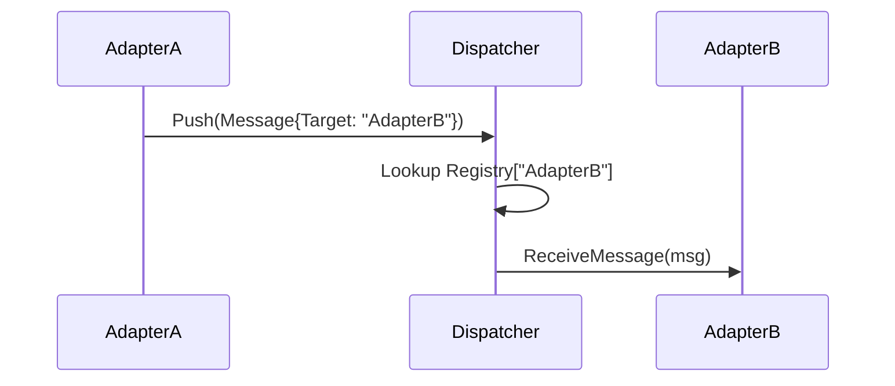

# MuseBot 核心路由模块 (Dispatcher) 设计文档

## 1. 模块概述
Dispatcher 是系统的“中枢神经”，负责管理所有适配器 (Adapter) 的生命周期，并根据预定义的路由协议高效地分发消息。它实现了**全对称消息总线**的核心逻辑，确保消息在不同适配器之间可靠流转。

## 2. 核心职责
- **适配器管理**: 负责 Adapter 的注册、注销、健康检查及生命周期维护。
- **消息路由**: 实现 P2P 投递及 标签匹配 (Tag Matching) 两种核心路由模式。
- **元数据富化**: 在分发前对消息进行拦截与标签注入 (Dispatcher Labeling)。
- **并发控制**: 异步调度消息，防止个别慢适配器（如 LLM）阻塞系统核心逻辑。

## 3. 核心数据结构

### 3.1 Dispatcher 定义
```go
type Dispatcher struct {
    // 适配器注册表: ID -> Adapter 实例
    adapters map[string]Adapter
    
    // 适配器属性索引: Tag -> []AdapterID (用于快速标签搜索)
    tagIndex map[string][]string
    
    // 消息入站通道
    inbound chan Message
    
    // 状态管理
    ctx    context.Context
    cancel context.CancelFunc
    mu     sync.RWMutex
}
```

### 3.2 路由优先级
Dispatcher 按照以下优先级决定消息去向：
1. **TargetAdapter**: 如果显式指定了目标 ID，则直接投递 (P2P)。
2. **Tags**: 如果存在 Tags，则投递给所有符合条件的适配器。
3. **默认路由**: 如果以上皆无，则投递给默认的兜底适配器。

## 4. 路由算法说明

### 4.1 P2P 投递


### 4.2 标签分发 (Tag Routing)
- Dispatcher 会维护一个简单的标签索引（或遍历活跃列表），对比消息的 `Tags` 与适配器的属性：
- **匹配规则**: 消息 `Tags` 是适配器属性标签的子集时，视为匹配成功。
- *场景*: 将某条广播消息发送给所有 `platform:lark` 的适配器，或将指令发给所有 `type:ai` 的适配器。

## 5. 消息生命周期流水线

1. **入站 (Push)**: 适配器通过 `inbound` 通道将消息提交给 Dispatcher。
2. **富化 (Enrich)**: 执行 `Dispatcher Labeling` 逻辑，基于正则或指令前缀注入 `Tags`。
3. **路由决策 (Match)**: 根据 Target 或 Tags 计算出目标适配器列表。
4. **异步投递 (Deliver)**: 为每个目标适配器开启轻量级 Goroutine 调用 `ReceiveMessage`。
5. **异常处理**: 如果投递失败，记录日志并进入死信逻辑。

## 6. 核心接口 (Interface)

```go
type IDispatcher interface {
    // 注册并启动适配器
    Register(adapter Adapter) error
    // 注销适配器
    Unregister(id string) error
    
    // 启动路由主循环
    Start(ctx context.Context) error
    
    // 外部推送接口
    Push(msg Message)
}
```

## 7. 性能与可靠性
- **零拷贝**: 消息通过引用传递，避免内存频繁拷贝。
- **背压处理 (Backpressure)**: 针对不同的 Adapter 设置缓存 Buffer，防止消息堆积导致 OOM。
- **监控指标**: 暴露每个适配器的消息处理时长和成功率，支持链路追踪。
