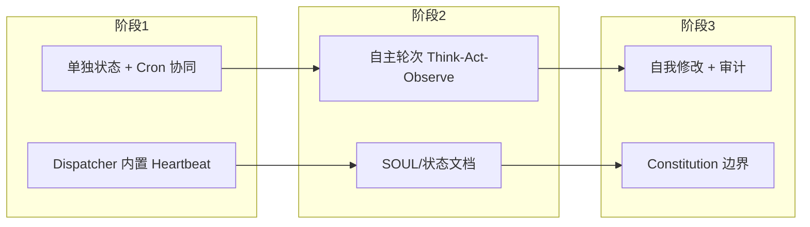

# MyBot 自主化与自我迭代/进化方案

> 结合《如何让 OpenClaw 主动找你搭话（发日报）？Heartbeat + Cron 终极攻略》与 [Conway-Research/automaton](https://github.com/Conway-Research/automaton)，给出「自主化 + 自我迭代/进化」的总体设计，不涉及具体代码实现。

---

## 一、背景与目标

### 1.1 现状

| 维度 | 当前能力 |
|------|----------|
| 触发方式 | 被动：用户消息 → Dispatcher → 执行端；或 **Cron 定时** 向 Inbound 投递预置 Message |
| Cron | 独立 Adapter，Message/HTTP 创建，SQLite 持久化，触发时按 payload 路由、reply_to 回源 |
| 主动行为 | 仅靠预置 Cron，内容与逻辑多为静态 |
| 自我进化 | 无：无身份/状态文档、无自我修改、无 Think-Act-Observe 闭环 |

**结论**：有「定时闹钟」，缺「持续在线的自主意识」和「根据结果自我调整」的闭环。

### 1.2 目标

- **自主化**：无人发消息时也能按节奏主动发起动作（日报、巡检、提醒），并可配置「做什么、何时做」的边界。
- **自我迭代/进化**：在安全边界内根据运行结果调整策略（Cron、prompt、经验），并具备可审计的自我修改与状态沉淀。

---

## 二、参考要点

### 2.1 Heartbeat + Cron（OpenClaw 攻略）

| 概念 | 作用 |
|------|------|
| **Heartbeat** | 模糊周期、保持在线感；「每隔一段时间看看要不要做点什么」 |
| **Cron** | 精确时刻；「每天 9 点发日报」等固定时间任务 |
| **组合** | Heartbeat 负责周期性思考，Cron 负责到点执行；二者配合实现主动搭话/发日报 |

对 MyBot：在 Cron 之上增加 **Heartbeat 维度**——常驻的、周期性运行的「思考/决策」循环。

### 2.2 Automaton 机制借鉴

| 机制 | 借鉴要点 |
|------|----------|
| 主循环 | Think → Act → Observe → Repeat → 引入「Agent 自主轮次」 |
| Heartbeat Daemon | 常驻后台：健康/资源/定时任务协调，必要时触发自主轮次 |
| SOUL/身份文档 | 可被 Agent 读写的持久化身份与状态，随运行演化 |
| Self-Modification | 边界内允许改 Cron、prompt、SOUL，全部审计+版本化 |
| Constitution | 不可变核心法则，自我修改不得违背 |

---

## 三、方案设计

### 3.1 架构原则

- **保持现有架构**：Adapter、Dispatcher、Inbound、Cron 不变；所有流量仍经 Inbound → dispatch → StateStore 记录。
- **新增两个逻辑角色**（不新增 Adapter 形态）：
  - **Heartbeat**：内置于 Dispatcher 的调度逻辑，按间隔或条件判断「是否发起一次自主轮次」。
  - **Agent 自主轮次**：一次无用户触发的 Think-Act-Observe，输入为 SOUL/状态与 Cron 计划，输出为动作（发日报、改 Cron、写 MEMORY）及状态更新。

用户消息与 Heartbeat 触发的消息都走同一条 Inbound，统一路由、统一 RecordMessage，便于 Admin 审计。

### 3.2 Heartbeat 设计（内置于 Dispatcher）

**为何放在 Dispatcher**

- Admin 已通过 StateStore 记录所有消息，Dispatcher 在 `dispatch()` 时调用 `RecordMessage()`，无需重复落库。
- Heartbeat 不单独成 Adapter，在 Dispatcher 内增加心跳逻辑即可，触发时向**自身 Inbound** Push 一条 Message，与用户消息走同一路径。

**触发判断（根据请求）**

- **输入**：当前时间、StateStore 查询（如最近 N 分钟是否有用户消息、距上次心跳时间）、以及**单独维护的 Heartbeat 状态**。
- **逻辑**：若满足条件（如「距上次心跳超过 interval」或「最近无用户消息需补一次自主轮次」），则构造 `source_adapter=heartbeat` 或 `Extra["trigger"]=heartbeat` 的 Message，Push 到 Inbound，由现有路由投递到 default 或指定执行端。
- **实现形态**：在 routeLoop 同进程内起心跳 goroutine，或在与 routeLoop 共用的 select 中加 tick/事件通道；按配置间隔或「每处理完若干条消息」做一次判断。

**状态单独记录**

- 与「消息日志」分离，不往消息表塞心跳元数据；单独维护：`last_trigger_at`、`trigger_count`、`next_due_at`（可选）、`enabled` 等。
- **存储**：StateStore 同一 DB 新增表（如 `heartbeat_state`），或单独小文件/键值；Dispatcher 判断前读取、触发后更新。
- **Admin**：可增加 Heartbeat 状态只读展示（上次触发时间、触发次数），与消息列表/统计并列。

### 3.3 主动搭话 / 日报（Heartbeat + Cron 分工）

| 角色 | 职责 |
|------|------|
| **Cron** | 到点执行：如每日 9:00 向 Inbound 投递一条 Message（payload 可带「请生成今日日报并发送给 xx」或仅触发指令）。 |
| **Heartbeat** | 周期内决策：按间隔判断是否发起自主轮次，若允许则投递自主轮次 Message；Agent 在轮次内可生成日报、决定立刻发或留待 Cron 到点再发，也可创建/修改 Cron 任务。 |

效果：**到点有动作**（Cron）+ **周期内有思考与内容生成**（Heartbeat），二者通过 Message 与 Dispatcher 协同。

### 3.4 自我迭代/进化（边界与审计）

**可自我修改（建议）**

- Cron 任务：创建/取消/调整（如增加每周复盘、调整日报时间）。
- SOUL/状态文档：Agent 读写身份与状态（SOUL.md、MEMORY 等），供下一轮 Think 使用。
- Prompt/技能片段：若设计为可编辑配置或文件，在审计下允许增删改（如日报模板、提醒话术）。

**不可修改（Constitution）**

- 核心安全与伦理规则；Dispatcher/Adapter 路由规则；Heartbeat 最大频率/最小间隔等；仅运维变更。

**审计与版本**

- 所有自我修改落盘、打时间戳、可追溯；必要时 git 或等价版本管理，便于回滚与审查。

### 3.5 与现有组件衔接

| 组件 | 衔接方式 |
|------|----------|
| **Dispatcher** | 内置 Heartbeat；根据 StateStore + 单独 Heartbeat 状态判断触发，触发时向自身 Inbound Push Message。 |
| **StateStore** | ① 继续记录所有消息（含 Heartbeat 触发的）；② 可选：同一 DB 新增 `heartbeat_state` 等表存心跳状态，供判断与 Admin 展示。 |
| **Cron Adapter** | 不变；Heartbeat 或 Agent 通过发 Message（cron_action: create/delete）或 HTTP API 管理任务。 |
| **Cursor/OpenCode** | 不变；通过 `source_adapter=heartbeat` 或 `Extra["trigger"]=heartbeat` 区分用户消息与自主轮次，以便选用不同 system prompt/工具集。 |
| **Smart Router** | 可按 source_adapter 或 trigger 将 Heartbeat 消息路由到指定执行端。 |

---

## 四、分阶段实施

| 阶段 | 目标 | 关键动作 |
|------|------|----------|
| **一** | 主动搭话/日报 | Dispatcher 内置 Heartbeat：根据 StateStore 查询 + 时间/间隔判断触发，向 Inbound 投递自主轮次 Message；单独记录 Heartbeat 状态（last_trigger_at、trigger_count），与消息日志分离、Admin 可查；与 Cron 协同。 |
| **二** | 自主轮次 + 状态 | 为 Agent 增加 SOUL/状态文档读写；Heartbeat 触发的 Message 携带状态摘要；执行端完成 Think-Act-Observe 后写回状态/记忆。 |
| **三** | 自我迭代与边界 | 在 Constitution 下开放自我修改（Cron、SOUL、模板）；全部审计+版本化；明确不可变规则与 Heartbeat 上下限。 |

---

## 五、小结

- **自主化**：Heartbeat 内置于 Dispatcher，根据请求（StateStore + 时间/间隔）判断触发，单独记录心跳状态；与 Cron 协同，实现无人发消息时也能主动发日报/搭话。
- **自我迭代/进化**：在 Constitution 与审计下，允许 Agent 修改 Cron、SOUL 与部分 prompt；Think-Act-Observe 闭环 + 状态持久化，使行为可随运行结果演化。
- **安全与可控**：Constitution 规定不可变核心；自我修改范围与频率受控；全量审计与版本化，便于回滚与审查。

方案借鉴 [automaton](https://github.com/Conway-Research/automaton) 的主循环、Heartbeat Daemon、SOUL、Self-Mod、Constitution 等思想，适配 MyBot 的 Adapter + Dispatcher + Cron 架构，在同一消息总线内完成「自主化 + 有限自我进化」。
