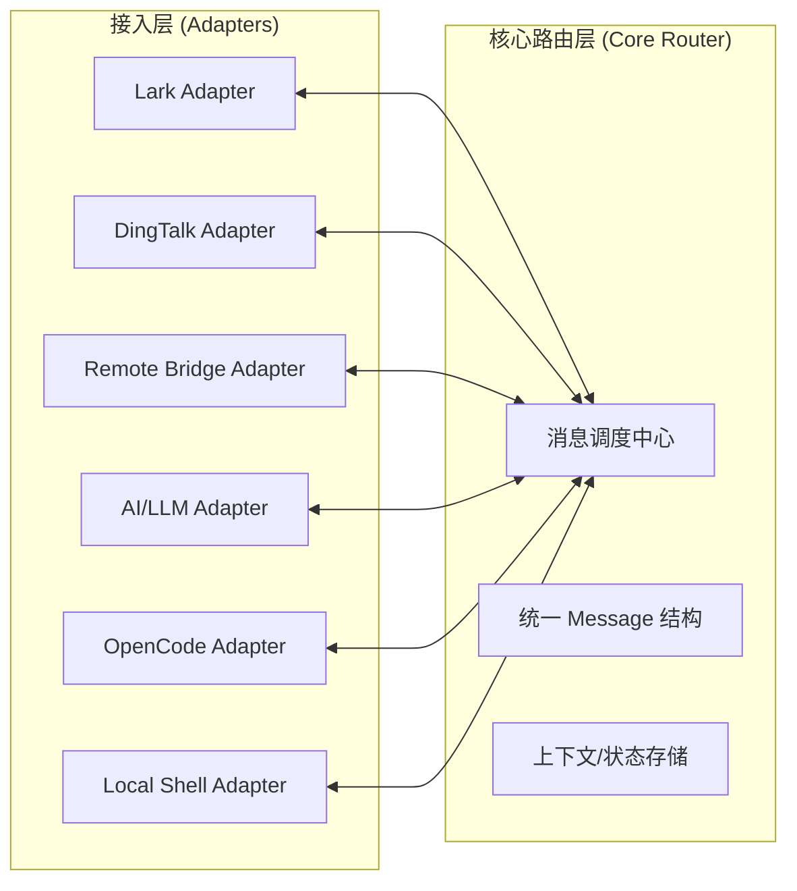

# MuseBot 跨平台消息代理与工具集成方案 (Omni-Adapter 架构)

本方案旨在构建一个高度解耦、全对称的消息通信框架。在本项目中，**万物皆适配器 (Everything is an Adapter)**。无论是前端社交平台、后端 AI 模型，还是本地执行工具，都通过统一的 Adapter 接口接入消息调度中心，实现真正意义上的平台无关与能力插件化。

## 1. 整体架构图



---

## 2. 核心设计原则

### 2.1 全对称消息总线
取消传统的“请求-响应” Processor 模式，系统由多个对等的 Adapter 组成。
- **对称性**: 消息从 A 发往 B，与 B 发往 A 遵循完全一致的路径和逻辑。
- **异步解耦**: 所有 Adapter 均通过入站/出站通道异步交换数据，天然支持长耗时任务（如代码执行、AI 生成）。

### 2.2 平台与能力透明化
调度中心不感知 Adapter 的具体类型。通过消息头中的路由字段，实现灵活的流转：
- **P2P 路由**: 明确指定 `TargetAdapter` ID，实现点对点投递（如从平台发往特定 AI）。
- **标签路由 (Tag Routing)**: 根据消息中的 `Tags` 列表，分发给匹配特定属性的 Adapter 组（如将指令发给所有 `type:executor` 的适配器）。

### 2.3 状态与上下文感知
通过 `StateStore` 接口，任何 Adapter 都可以根据 `ConversationID` 获取或更新会话状态，从而支持复杂的跨 Adapter 协作流程。

### 2.4 可靠性与弹性
- **优雅退场**: 统一支持 Context 取消信号。
- **流控与隔离**: 每个 Adapter 拥有独立的缓冲区，防止慢消费者（如 AI 生成速度慢）阻塞整个系统。

---

## 3. 核心定义

### 3.1 统一消息模型 (Message Model)

```go
type Message struct {
    ID             string                 // 消息唯一标识
    SourceAdapter  string                 // 来源适配器 ID
    TargetAdapter  string                 // 目标适配器 ID (可选，P2P 路由)
    Tags           []string               // 标签列表 (可选，用于分组路由)
    
    // 核心业务上下文 (必须)
    UserID         string                 // 发送者唯一 ID (用于权限与状态识别)
    Channel        string                 // 频道/群组/会话 ID (用于消息归口)
    
    // 核心载荷
    Content        string                 // 文本内容或主要 Payload
    Files          []File                 // 文件列表 (可选，用于传输附件)
    Type           MessageType            // 消息类型 (text, command, interaction, event, thinking；附件走 Files)
    Timestamp      int64                  // 发生时间
    
    // 扩展字段 (非核心属性放入此处，如 Username, Avatar, Account, ParentID, TraceID 等)
    Extra          map[string]interface{} 
}

// File 文件信息结构
type File struct {
    ID       string `json:"id"`       // 文件唯一标识 (在对应平台上的ID)
    Name     string `json:"name"`     // 文件名
    Size     int64  `json:"size"`     // 文件大小 (字节)
    URL      string `json:"url"`      // 文件下载地址 (如果可用)
    MimeType string `json:"mime_type"` // MIME 类型 (如 image/png, application/pdf)
    Path     string `json:"path"`     // 文件本地路径 (在处理过程中临时存储)
}
```

### 3.2 适配器接口 (Adapter Interface)

```go
type Adapter interface {
    // 注册标识符 (如 "lark_01", "opencode_service")
    GetID() string
    
    // 启动监听：接收端上事件 -> 封装 Message -> 投递至 inbound
    Start(ctx context.Context, inbound chan<- Message) error
    
    // 接收调度中心转发的消息并执行具体逻辑
    // 内部工具（如 OpenCode）收到消息后处理，处理完通过 inbound 通道发回结果
    ReceiveMessage(ctx context.Context, msg Message) error
    
    // 返回该适配器的当前状态 (Connected, Busy, Offline)
    Status() string
}
```

---

## 4. 集成与流转流程

### 4.1 典型交互链路：代码执行
1. **输入**: 用户在飞书发送消息 -> `Lark Adapter` 捕获并封装为 `Message`，投递至 `Dispatcher`。
2. **路由**: `Dispatcher` 根据内容（如包含 `/run` 指令）路由至 `OpenCode Adapter`。
3. **执行**: `OpenCode Adapter` 接收并异步启动代码容器。
4. **输出**: 执行完毕，`OpenCode Adapter` 构造结果 `Message` 发回 `Dispatcher`。
5. **分发**: `Dispatcher` 根据 `ConversationID` 或路由规则将结果消息投递回 `Lark Adapter`。

### 4.2 消息流转全生命周期
1. **捕获**: Adapter 接收原始事件并封装为标准 `Message`，同时根据平台特性注入初始元数据。
2. **富化**: Dispatcher 接收消息后，根据内容识别指令或意图，动态追加 `Topic` 或 `Tags`。
3. **调度**: Dispatcher 根据最终的路由元数据（Target 或 Tags）分发至对应 Adapter。
4. **执行**: 目标 Adapter（如 AI/Code）处理逻辑，产生响应消息并显式设置返回路由（通常将请求的 SourceAdapter 设为响应的 TargetAdapter）。
5. **交付**: Dispatcher 根据响应消息的路由信息投递回来源 Adapter。

### 4.3 消息路由元数据注入 (Metadata Injection)
由于原始平台（Lark/DingTalk 等）不具备路由字段，元数据通过以下三层注入：

- **适配器层 (Adapter Enrichment)**: 
    - 适配器在构造 `Message` 时自动添加默认标签（如 `platform:lark`）。
- **调度层 (Dispatcher Labeling)**: 
    - 调度中心通过静态规则或正则，根据内容识别意图（如 `/run` 识别为 `type:executor` 标签）。
- **产出层 (Producer Specification)**: 
    - 内部能力适配器（如 AI）主动发起消息时，显式指定目标 `TargetAdapter` 或 `Tags`。

### 4.4 配置示例

```yaml
system:
  trace_enabled: true

adapters:
  # 外部平台适配器
  - id: "lark_main"
    type: "lark"
    config: { ... }

  # 能力适配器 (原 Processor)
  - id: "ai_claude"
    type: "llm"
    config: { model: "claude-3", api_key: "..." }

  - id: "executor_local"
    type: "opencode"
    config: { sandbox: true }

  # 远程网关适配器
  - id: "upstream_bridge"
    type: "remote_bridge"
    config: { url: "ws://..." }
```

## 5. 优点总结

1.  **极度解耦**: 核心调度器逻辑降至最简，只需关注消息的“搬运”。
2.  **无限扩展**: 增加一个新功能（如代码扫描、财务报表）只需实现 `Adapter` 接口并配置 ID，无需修改核心路由。
3.  **支持主动式 AI**: AI 适配器可以基于定时任务或外部钩子，主动向任何其他适配器发起对话。
